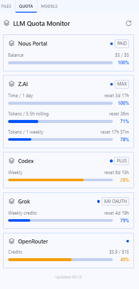

<div align="center">

# 📊 Hermes LLM Quota Monitor

A standalone plugin for [Hermes Agent](https://github.com/NousResearch/hermes-agent) that shows **live quota and usage** for all your LLM providers in one place.

<br>



<br>

[](#development)
[](dashboard/manifest.json)
[](LICENSE)
[](https://www.python.org/)

</div>

---

## ✨ Supported Providers

| Provider | Auth Method | Quota Type |
|----------|-------------|------------|
| **[Z.AI](https://z.ai)** | `ZAI_API_KEY` or `GLM_API_KEY` | Time + token limits (daily, rolling, weekly) |
| **[OpenAI Codex](https://chatgpt.com)** | Hermes `openai-codex` auth store | Rate-limit windows (primary + secondary) |
| **[Grok (xAI)](https://x.ai)** | Hermes `xai-oauth` auth store | Weekly shared credits + monthly extra credits |
| **[Nous Research Portal](https://portal.nousresearch.com)** | Hermes `nous` OAuth (Portal subscription) | USD balance (subscription + purchased credits) |
| **[OpenRouter](https://openrouter.ai)** | `OPENROUTER_API_KEY` | USD credits (total / usage) |

Each provider returns explicit status states: `ok`, `no_key`, `no_token`, `expired`, `forbidden`, or `error` — no silent failures.

## 🎯 Features

- **Dual-surface UI** — web dashboard tab + native desktop pane with status-bar chip
- **Real-time monitoring** — auto-refresh every 60s with manual refresh button
- **Multi-window quotas** — providers with multiple limits (Z.AI daily/rolling/weekly) each get their own progress bar
- **Visual indicators** — color-coded progress bars (blue = healthy, orange = warning, red = critical)
- **Zero secret exposure** — backend returns only percentages, plan labels, and reset times; no API keys, tokens, or account emails
- **SSRF-hardened** — portal base URLs validated against an allowlist before any authenticated request

## 📦 Installation

The web dashboard plugin and the native desktop plugin are separate Hermes extension surfaces. They share one backend namespace: `/api/plugins/llm-quota/`.

### Backend + Web Dashboard

```bash
hermes plugins install bnogalski/hermes-llm-quota
hermes plugins enable llm-quota
```

The API mounts at `/api/plugins/llm-quota/`. Restart the dashboard or gateway process if the installed plugin is not picked up. The backend must be enabled in `plugins.enabled` for its API routes to mount.

### Native Desktop Pane

```bash
mkdir -p "$HERMES_HOME/desktop-plugins/llm-quota"
cp desktop/llm-quota/plugin.js "$HERMES_HOME/desktop-plugins/llm-quota/plugin.js"
```

> **Windows:** use `%HERMES_HOME%\desktop-plugins\llm-quota\plugin.js`.
> If `HERMES_HOME` is not set, Hermes uses `%LOCALAPPDATA%\hermes`.

Reload desktop plugins via **⌘K → Reload desktop plugins**. The plugin registers:
- A **right-side quota pane**
- A **status-bar chip** (color-coded by lowest remaining %)
- A **desktop route** at `/llm-quota`
- **Sidebar navigation** entry

The desktop ID is `llm-quota`, matching the backend namespace, so `ctx.rest('/all')` is the official scoped API door.

## 🔧 Requirements

- [Hermes Agent](https://github.com/NousResearch/hermes-agent) with the web dashboard
- [Hermes Desktop](https://hermes-agent.nousresearch.com/docs/user-guide/desktop) for the native pane and status-bar chip
- Credentials configured for at least one provider
- The dashboard plugin enabled in Hermes configuration

## 📁 Project Layout

```text
plugin.yaml
__init__.py                       # side-effect-free Python entrypoint
dashboard/
  manifest.json                   # dashboard tab and backend declaration
  dist/index.js                   # dashboard IIFE entry (web plugin SDK)
  plugin_api.py                   # FastAPI router (provider quota logic)
desktop/
  llm-quota/plugin.js             # native desktop disk plugin (ESM)
tests/
  test_plugin_api.py              # 18 unit + regression tests
  test_plugin_contract.py         # 5 SDK contract tests
assets/
  quota-monitor-screenshot.png    # README screenshot
```

## 🛠️ Development

```bash
# Run the test suite (no live API calls)
python -m pytest tests -q

# Validate JavaScript syntax
node --check desktop/llm-quota/plugin.js
node --check dashboard/dist/index.js
```

## 🔒 Security

- **No secrets in responses** — provider API responses are filtered to usage data only
- **SSRF protection** — `portal_base_url` is validated against `_NOUS_PORTAL_ALLOWED_HOSTS` before any authenticated request (same allowlist core Hermes uses)
- **NaN/Infinity hardening** — provider responses with non-finite numeric values are sanitized to prevent JSON serialization crashes
- **Bearer token redaction** — error messages strip bearer tokens before logging

## ❤️ Support

If this plugin saved you some time, a tip is always appreciated.

**BTC (Bech32):** `bc1q4refcfue5dvatkx96e3xv7xr6pde24u20nvjfv`

## 📄 License

MIT, Copyright (c) 2026 Bartosz Nogalski
